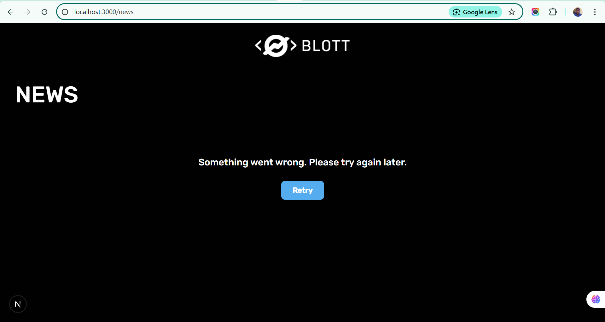
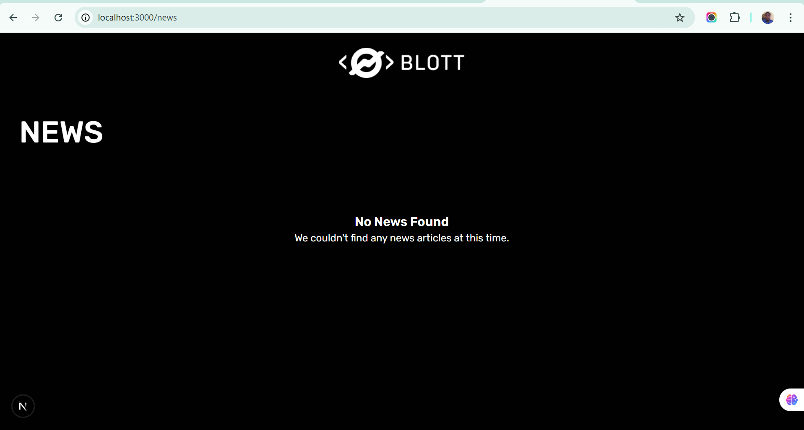

# **SUGGESTIONS**

# **Main API**

Considering application performance, user experience, and cost efficiency.

Here are my recommendations, structured from most important to least, followed by the code implementation for an "infinite scroll" or "load more" feature in my `NewsList` component.

---

### **Recommendations for the Backend Team**

**Subject: API Optimization for `/api/v1/news` Endpoint**

Hi Team,

I've successfully integrated the `/api/v1/news` endpoint into the Next.js frontend via my BFF (Backend-for-Frontend) route at `/api/news`. As I moved forward, I've identified that the `general` category returns a very large, un-paginated list of articles. To ensure the application is performant, scalable, and provides a good user experience, I recommend we implement server-side pagination.

Here are the suggested changes:

**1. Implement Cursor-Based or Offset/Limit Pagination (Critical Priority)**

This is the single most important optimization. Instead of returning all articles at once, the API should return a "page" of results.

- **Suggestion:** Implement **offset/limit** pagination. It's standard and easy to understand.

  - **`limit` (query parameter):** The number of articles to return per page. A good default would be `20`. (e.g., `?limit=20`)
  - **`offset` (query parameter):** The number of articles to skip. For page 2 with a limit of 20, the offset would be 20. (e.g., `?limit=20&offset=20`)

- **API Response Modification:** The API response should be wrapped in an object that includes pagination metadata.

  **Current Response:** `[ {article1}, {article2}, ... ]`

  **Recommended Response:**

  ```json
  {
    "count": 1540, // Total number of articles available
    "next": "https://finnhub.io/api/v1/news?category=general&limit=20&offset=20", // URL for the next page (or null)
    "previous": null, // URL for the previous page (or null)
    "results": [ // The array of articles for the current page
      { "id": 7497241, "headline": "...", ... },
      { "id": 7497238, "headline": "...", ... }
    ]
  }
  ```

- **Why:** This drastically reduces the initial payload. The current API response is inefficient for a frontend application and should be optimized on the backend.

---

### **Frontend Refactor (Implementing Client-Side Pagination)**

Since I am working with the current API response, I have implemented a **client-side pagination** as a temporary measure. We will fetch all the data once, store it in Zustand, and then slice the array for display on the client.

# **Others:**

```bash
# Switch .env.local file to this
NEXT_PUBLIC_SUGGESTED=true # to test recommendation
NEXT_PUBLIC_NODE_ENV=test # Sample JSON test to complete the UI Flow when Backend API not ready

```

**1.**

```tsx
// To test the error or empty list state:
const isLoading = false;
const articles: FinhubNewsArticle[] = []; // (parent would show error)
```

**Server error**



**Info when no error, but fetch request returns an empty list**



**1b.**

Consider centering the Error message, if retry button is adopted.

**2.**

```tsx
// To test the loading state:
const isLoading = true;
const articles: FinhubNewsArticle[] = [];
```

Consider displaying animated skeleton or any other loading state design, when trying to fetch data and loading is true


**3.**

Consider adding sticky nav on scroll


